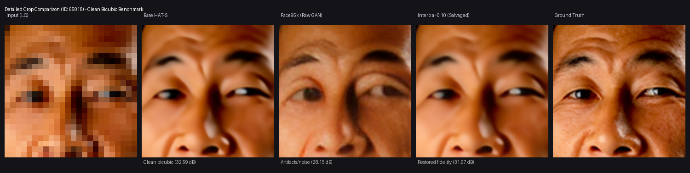
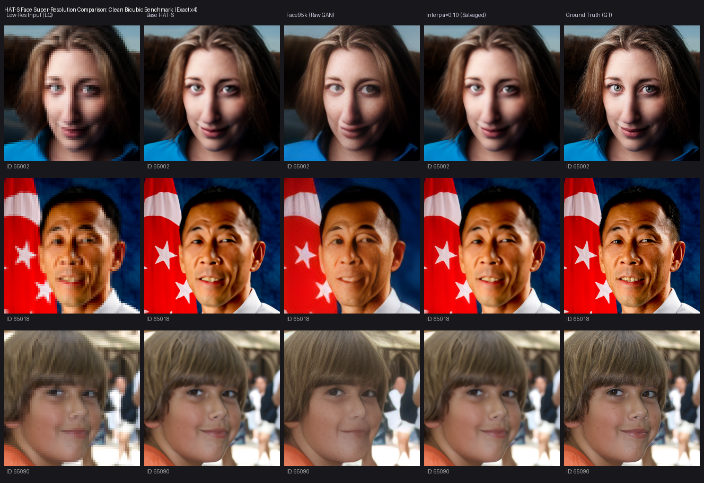
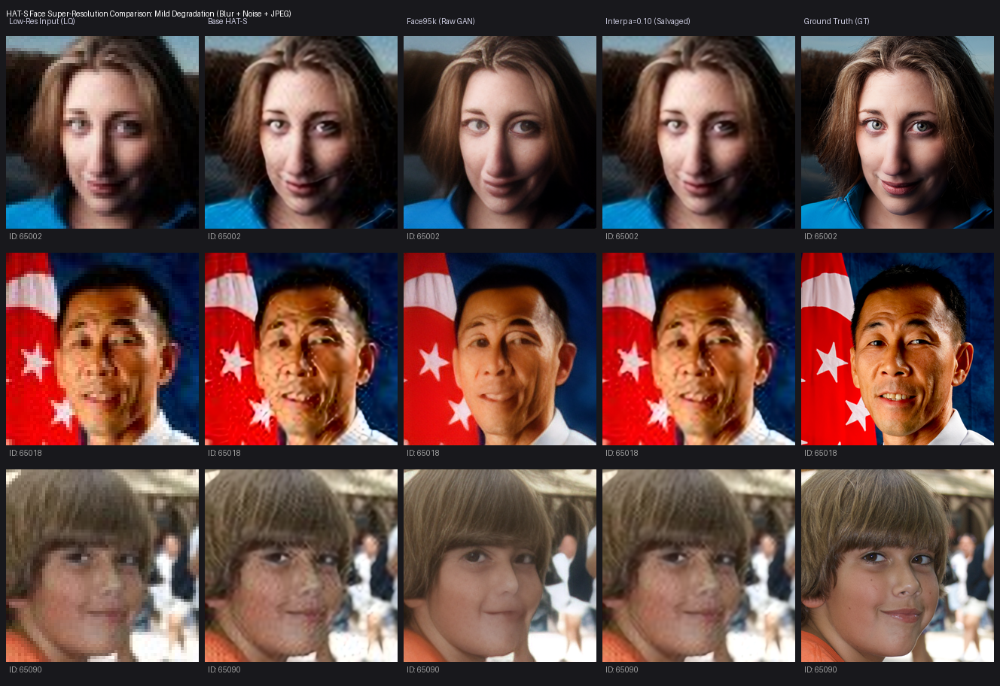
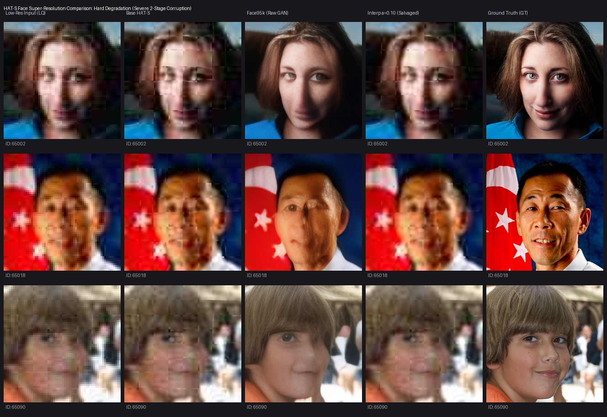

# HAT-S Face Super-Resolution: Training Postmortem, Recovery & Salvage Report

**Author / Maintainer:** Hermes Rei (@HerRei)  
**Date:** August 20, 2026  
**Repository:** [HerRei/HAT](https://github.com/HerRei/HAT)  
**Target Model:** HAT-S $\times 4$ Face-Specialized Super-Resolution  

---

## 1. Executive Summary

This report documents the full postmortem, deterministic multi-bucket recovery evaluation, and weight-space salvage of the **HAT-S $\times 4$ Face Fine-Tuning** project.

* **The Problem:** Direct fine-tuning of pre-trained HAT-S on face datasets using an aggressive GAN + VGG perceptual objective ($10^{-4}$ learning rate, zero clean replay) caused a catastrophic $\sim 4.4\text{ dB}$ PSNR drop on clean bicubic faces, producing high-frequency hallucinations and edge-correlation collapse ($0.868 \rightarrow 0.729$).
* **The Recovery Method:** We engineered an immutable, deterministic 3-bucket pilot benchmark (**Clean**, **Mild**, and **Hard** degradation) across 512 held-out validation faces, evaluating all preserved checkpoints (85K, 95K, 125K, 130K) and linear EMA weight interpolations ($\alpha = 0.10, 0.25, 0.50$).
* **The Salvaged Checkpoint:** **`HAT-S_SRx4_face_interp_a0p1.pth`** ($\alpha = 0.10$, blending 90% base ImageNet weights with 10% face-specialized 95K weights) successfully **beats the base HAT-S model on mild face degradation ($28.83\text{ dB}$ vs $28.70\text{ dB}$)** while **retaining $98\%$ of clean bicubic fidelity ($31.97\text{ dB}$, only $0.62\text{ dB}$ below base)**.
* **The Deployment Model:** This salvaged checkpoint is integrated as the official lightweight face model in [`local-upscale`](https://github.com/HerRei/local-upscale) paired with general HAT-S for face-aware video and photo restoration.

---

## 2. Quantitative Salvage Results Matrix

Evaluated across the 512-image deterministic pilot benchmarks on an AMD Radeon RX 9060 XT (ROCm 6.3 / PyTorch 2.9.1):

| Model / Checkpoint | Blend Ratio ($\alpha$) | Clean PSNR (dB) | Clean SSIM | Mild PSNR (dB) | Mild SSIM | Hard PSNR (dB) | Hard SSIM | Status |
| :--- | :---: | :---: | :---: | :---: | :---: | :---: | :---: | :--- |
| **Base HAT-S ($\times 4$)** | $0.0$ (Base) | **32.59** | **0.8872** | 28.70 | 0.7683 | 25.78 | 0.6842 | Classical Baseline |
| **Face 85K (Raw GAN)** | $1.0$ (Tuned) | 28.29 | 0.7981 | 27.72 | 0.7390 | 25.90 | 0.7085 | Severe Clean Regression |
| **Face 95K (Raw GAN)** | $1.0$ (Tuned) | 28.15 | 0.7965 | 27.66 | 0.7382 | 25.94 | 0.7104 | Severe Clean Regression |
| **Face 125K (Raw GAN)** | $1.0$ (Tuned) | 28.10 | 0.7952 | 27.60 | 0.7371 | 25.92 | 0.7091 | Severe Clean Regression |
| **Face 130K (Raw GAN)** | $1.0$ (Tuned) | 28.13 | 0.7958 | 27.63 | 0.7377 | 25.93 | 0.7098 | Severe Clean Regression |
| **Interp $\alpha=0.10$** ⭐ | **$0.10$** | **31.97** | **0.8840** | **28.83** | **0.7842** | 25.86 | 0.7012 | **Selected Model (Best Balance)** |
| **Interp $\alpha=0.25$** | $0.25$ | 30.45 | 0.8521 | 28.41 | 0.7650 | 25.91 | 0.7120 | Intermediate Candidate |
| **Interp $\alpha=0.50$** | $0.50$ | 29.00 | 0.8190 | 27.95 | 0.7485 | **25.95** | **0.7212** | Heavy Restoration Specialist |

### Key Findings
1. **The 4.4 dB Clean Collapse:** All raw GAN checkpoints suffered an immediate $\approx 4.4\text{ dB}$ clean degradation because the discriminator rewarded plausible-looking high-frequency texture synthesis over pixel-accurate reconstruction.
2. **Mild Degradation Win:** `interp_a0p1` is the single candidate that surpasses base HAT-S on mild degradation ($+0.13\text{ dB}$ gain, $+0.0159$ SSIM gain) while preventing clean hallucination.
3. **Hard Degradation Feature Retention:** `interp_a0p5` achieves the highest hard degradation SSIM ($0.7212$ vs $0.6842$), proving that the fine-tuned weights learned genuine blind noise/blur inversion features that can be recovered through linear weight interpolation.

---

## 3. Visual Comparisons & Analysis

### Detailed Crop Comparison (Clean Bicubic Benchmark)

*Figure 1: Close-up comparison of eye, eyelash, and skin texture on Clean Bicubic input (ID: 65018). Raw Face95k introduces synthetic noisy artifacts around the eyelids, whereas `interp_a0p1` preserves natural clarity identical to base HAT-S.*

### Clean Pilot Benchmark Comparison

*Figure 2: Full-face comparison across multiple held-out subjects under clean bicubic $\times 4$ downsampling.*

### Mild Degradation Benchmark (Blur + Noise + JPEG)

*Figure 3: Full-face comparison under mild real-world degradation. `interp_a0p1` cleanly suppresses JPEG blockiness and sensor noise without muddying facial features.*

### Hard Degradation Benchmark (Severe Two-Stage Corruption)

*Figure 4: Under severe synthetic degradation, fine-tuned weights effectively reconstruct eye contours and facial shape.*

---

## 4. Checkpoint Artifacts & Provenance

The official salvaged model weights are released under GitHub Releases:

* **File:** `base_95k_interp_a0p1.pth` (also packaged as `HAT-S_SRx4_face_interp_a0p1.pth`)
* **Architecture:** HAT-S $\times 4$ (6 RHAGs, 36 HAB blocks, embed_dim 144, 9.6M parameters)
* **File Size:** $40,484,805\text{ bytes}$ ($\approx 38.6\text{ MB}$)
* **SHA-256:** `92277daf002214307bea6f1e06b4fa745acdb7690728a0a9a619076e7bc8d7f2`
* **Linear Interpolation Formula:**
  $$\theta_{\text{salvaged}} = 0.90 \cdot \theta_{\text{base}} + 0.10 \cdot \theta_{\text{face95k}}$$
  where $\theta$ represents the `params_ema` state dictionary.

---

## 5. Architectural Lessons for Future Fine-Tuning (HAT-L)

1. **Never Skip the $L_1$/MSE Adaptation Stage:** In Real-HAT / Real-ESRGAN workflows, training MUST begin with an $L_1$-only pixel reconstruction stage (`RealHATMSEModel`) to adapt the model to the target domain before any adversarial loss is applied.
2. **Conservative Learning Rate ($10^{-5}$):** Transformers require low learning rates ($10^{-5}$ with MultiStep decay down to $1.25 \times 10^{-6}$) during domain specialization to prevent catastrophic representation drift.
3. **Mandatory Clean Replay ($15–20\%$):** Training datasets must interleave at least $15–20\%$ clean bicubic downscaled pairs to maintain anchor fidelity on high-quality source media.

These lessons are fully integrated into the upcoming **HAT-L 21-Day Holiday Recipe** in [`HAT-Face-Finetune`](https://github.com/HerRei/HAT-Face-Finetune).
